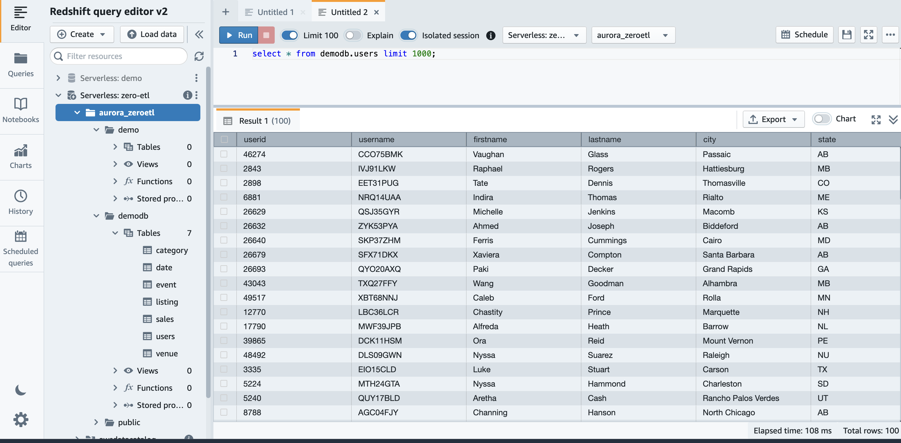

## Architecture

- Add s3 vpc endpoint to the vpc for loading data from s3 to aurora
- Create an aurora cluster with customized cluster parameter group
- Create amazon redshift preview workshop and namespace
- Configure amazon redshift sensitive case true
- Configure amazon redshift authorized zero etl integration

First, let create a aurora cluster as below

```ts
import { Stack, StackProps, aws_ec2, aws_iam, aws_rds } from "aws-cdk-lib";
import { Construct } from "constructs";

interface AuroraDbStackProps extends StackProps {
  vpc: aws_ec2.Vpc;
  dbName: string;
  dbSG: aws_ec2.SecurityGroup;
  role: aws_iam.Role;
}

export class AuroraDbStack extends Stack {
  constructor(scope: Construct, id: string, props: AuroraDbStackProps) {
    super(scope, id, props);

    const vpc: aws_ec2.Vpc = props.vpc;

    const clusterPG = new aws_rds.CfnDBClusterParameterGroup(
      this,
      "ParameterGroupAuroraEtlZero",
      {
        description: "parameter group for aurora zero-etl",
        family: "aurora-mysql8.0",
        dbClusterParameterGroupName: "ParameterGroupAuroraEtlZero",
        parameters: {
          binlog_backup: 0,
          binlog_replication_globaldb: 0,
          binlog_format: "ROW",
          aurora_enhanced_binlog: 1,
          binlog_row_metadata: "FULL",
          binlog_row_image: "FULL",
        },
      }
    );

    const subnetGroup = new aws_rds.CfnDBSubnetGroup(
      this,
      "SubnetGroupAuroraEtlZero",
      {
        dbSubnetGroupDescription: "subnet group for aurora etl zero",
        dbSubnetGroupName: "SubnetGroupAuroraEtlZero",
        subnetIds: vpc.publicSubnets.map((subnet) => subnet.subnetId),
      }
    );

    const cluster = new aws_rds.CfnDBCluster(this, "AuroraEtlZero", {
      dbClusterIdentifier: "AuroraEtlZero",
      dbClusterParameterGroupName: clusterPG.dbClusterParameterGroupName,
      dbSubnetGroupName: subnetGroup.dbSubnetGroupName,
      deletionProtection: false,
      autoMinorVersionUpgrade: false,
      databaseName: "demo",
      engine: "aurora-mysql",
      engineVersion: "8.0.mysql_aurora.3.03.1",
      engineMode: "provisioned",
      vpcSecurityGroupIds: [props.dbSG.securityGroupId],
      // publiclyAccessible: false,
      masterUsername: "admin",
      masterUserPassword: "Admin2023",
      // performanceInsightsEnabled: false,
      enableCloudwatchLogsExports: [],
      enableIamDatabaseAuthentication: false,
      associatedRoles: [
        {
          roleArn: props.role.roleArn,
        },
      ],
    });

    const db1 = new aws_rds.CfnDBInstance(this, "FirstDbInstance", {
      // sourceDbClusterIdentifier: cluster.ref,
      dbClusterIdentifier: cluster.ref,
      dbInstanceIdentifier: "FirstDbInstance",
      dbInstanceClass: "db.r6g.2xlarge",
      engine: "aurora-mysql",
      // engineVersion: "8.0.mysql_aurora.3.03.1",
      // dbParameterGroupName: dbPG.dbParameterGroupName,
      enablePerformanceInsights: false,
    });

    cluster.addDependency(clusterPG);
    cluster.addDependency(subnetGroup);
  }
}
```

Then create amazon redhisft namespace (preview) from aws console, then update case sensitive true by cli

```bash
aws redshift-serverless update-workgroup --workgroup-name zero-etl --config-parameters parameterKey=enable_case_sensitive_identifier,parameterValue=true --region us-east-1
```

Finally, from amazon redshift configure authorized principals and authorized integration sources (ARN of the aurora cluster).

## Zero-ETL with Aurora and Redshift

- Connecto to aurora using mysql client
- Load data from s3 to aurora
- Verify results from amazon redshift query v2

First, from an ec2 instance or sagemaker notebook, install mariadb to get mysql client

```bash
dnf install -y mariadb
```

Second, connect to aurora, create tables and loada the TICKIT dataset into it

<details>
  <aurora data>

```bash
export host=xxx.xxx.us-east-1.rds.amazonaws.com
export password=xxx
dnf update
dnf install -y mariadb
touch run.sh
echo 'export host=' >> run.sh
echo 'export user=demo' >> run.sh
echo 'export password=' >> run.sh
echo 'mysql --host=$host --user=$user --password=$password -f < aurora-tickit-db.sql' >> run.sh
chmod 700 run.sh
```

</details>

Load TICKIT dataset into the aurora database

<details>
  <aurora data>

```sql
Tickit.db in MySQL

create database demodb;

create table demodb.users(
    userid integer not null primary key,
    username char(8),
    firstname varchar(30),
    lastname varchar(30),
    city varchar(30),
    state char(2),
    email varchar(100),
    phone char(14),
    likesports boolean,
    liketheatre boolean,
    likeconcerts boolean,
    likejazz boolean,
    likeclassical boolean,
    likeopera boolean,
    likerock boolean,
    likevegas boolean,
    likebroadway boolean,
    likemusicals boolean);

create table demodb.venue(
    venueid integer not null primary key,
    venuename varchar(100),
    venuecity varchar(30),
    venuestate char(2),
    venueseats integer);


create table demodb.category(
    catid integer not null primary key,
    catgroup varchar(10),
    catname varchar(10),
    catdesc varchar(50));


create table demodb.date (
    dateid integer not null primary key,
    caldate date not null,
    day character(3) not null,
    week smallint not null,
    month character(5) not null,
    qtr character(5) not null,
    year smallint not null,
    holiday boolean default FALSE );


create table demodb.event(
    eventid integer not null primary key,
    venueid integer not null,
    catid integer not null,
    dateid integer not null,
    eventname varchar(200),
    starttime timestamp);


create table demodb.listing(
    listid integer not null primary key,
    sellerid integer not null,
    eventid integer not null,
    dateid integer not null,
    numtickets smallint not null,
    priceperticket decimal(8,2),
    totalprice decimal(8,2),
    listtime timestamp);


create table demodb.sales(
    salesid integer not null primary key,
    listid integer not null,
    sellerid integer not null,
    buyerid integer not null,
    eventid integer not null,
    dateid integer not null,
    qtysold smallint not null,
    pricepaid decimal(8,2),
    commission decimal(8,2),
    saletime timestamp);

--- For IAD (us-east-1, N Virginia) region, please use below load scripts:
LOAD DATA FROM S3 PREFIX 's3://redshift-blogs/zero-etl-integration/data/tickit/users/' INTO TABLE demodb.users FIELDS TERMINATED BY '|';
LOAD DATA FROM S3 PREFIX 's3://redshift-blogs/zero-etl-integration/data/tickit/event/' INTO TABLE demodb.event FIELDS TERMINATED BY '|';
LOAD DATA FROM S3 PREFIX 's3://redshift-blogs/zero-etl-integration/data/tickit/category/' INTO TABLE demodb.category FIELDS TERMINATED BY '|';
LOAD DATA FROM S3 PREFIX 's3://redshift-blogs/zero-etl-integration/data/tickit/date/' INTO TABLE demodb.date FIELDS TERMINATED BY '|';
LOAD DATA FROM S3 PREFIX 's3://redshift-blogs/zero-etl-integration/data/tickit/listing/' INTO TABLE demodb.listing FIELDS TERMINATED BY '|';
LOAD DATA FROM S3 PREFIX 's3://redshift-blogs/zero-etl-integration/data/tickit/venue/' INTO TABLE demodb.venue FIELDS TERMINATED BY '|';
LOAD DATA FROM S3 PREFIX 's3://redshift-blogs/zero-etl-integration/data/tickit/sales/' INTO TABLE demodb.sales FIELDS TERMINATED BY '|';

--- For PDX (us-west-2, Oregon) region, please use below load scripts:
LOAD DATA FROM S3 PREFIX 's3://redshift-immersionday-labs/data/tickit/users/' INTO TABLE demodb.users FIELDS TERMINATED BY '|';
LOAD DATA FROM S3 PREFIX 's3://redshift-immersionday-labs/data/tickit/event/' INTO TABLE demodb.event FIELDS TERMINATED BY '|';
LOAD DATA FROM S3 PREFIX 's3://redshift-immersionday-labs/data/tickit/category/' INTO TABLE demodb.category FIELDS TERMINATED BY '|';
LOAD DATA FROM S3 PREFIX 's3://redshift-immersionday-labs/data/tickit/date/' INTO TABLE demodb.date FIELDS TERMINATED BY '|';
LOAD DATA FROM S3 PREFIX 's3://redshift-immersionday-labs/data/tickit/listing/' INTO TABLE demodb.listing FIELDS TERMINATED BY '|';
LOAD DATA FROM S3 PREFIX 's3://redshift-immersionday-labs/data/tickit/venue/' INTO TABLE demodb.venue FIELDS TERMINATED BY '|';
LOAD DATA FROM S3 PREFIX 's3://redshift-immersionday-labs/data/tickit/sales/' INTO TABLE demodb.sales FIELDS TERMINATED BY '|';
```

</details>

Finally, from redshift edtior v2 run this query to get the integration id

```sql
select integration_id from svv_integration;
```

Then create database which sync with aurora

```sql
CREATE DATABASE aurora_zeroetl FROM INTEGRATION '<result from above>';
```

From here, we can query tabls synced with aurora



## Reference

- [aws docs zero-etl aurora redshift](https://docs.aws.amazon.com/AmazonRDS/latest/AuroraUserGuide/zero-etl.setting-up.html)

- [TICKIT data S3 to aurora](https://redshift-demos.s3.amazonaws.com/sql/ZTL/Tickit.db+in+MySQL.html)
